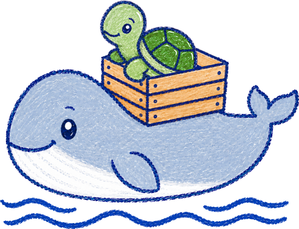

<h1>
  
  <br>
  tortoise-deploy
</h1>

[![Lint status][badge-lint-status]][badge-lint-status-url]
[![Build status][badge-build-status]][badge-build-status-url]\
[![Latest stable Tortoise-WoW build][badge-latest-stable-build]][badge-latest-stable-build-url]
[![Latest unstable Tortoise-WoW build][badge-latest-unstable-build]][badge-latest-unstable-build-url]\
[![Latest build date][badge-latest-build-date]][badge-latest-build-date-url]

> A Docker setup for Tortoise-WoW

> [!TIP]
> Also check out my similar Docker setups:
>
> - [vmangos-deploy][vmangos-deploy] for [VMaNGOS][vmangos], a progressive
>   Vanilla server emulator that aims to eventually support all versions from
>   `1.2.4.4222` to `1.12.1.5875`.
> - [cmangos-deploy][cmangos-deploy] for [CMaNGOS][cmangos], a server emulator
>   that supports Vanilla (which CMaNGOS calls Classic), TBC and WotLK.

tortoise-deploy is a Docker-based solution for running
[Tortoise-WoW][tortoise-wow] that focuses on providing a streamlined and
user-friendly experience. It offers a range of features that simplify managing
a Tortoise-WoW setup:

- __Prebuilt Docker images for both `amd64` and `arm64`, leveraging GitHub__
  __Actions__: simply pull the provided images that have been optimized for
  size, performance and stability instead of having to re-compile Tortoise-WoW
  yourself every time you want to update.
- __Stable and unstable image builds__: choose between `stable` images built
  from the `main` branch and `unstable` images that track the active `1181dev`
  development branch.
- __Seamless, automated database migrations__: when pulling the latest Docker
  images and re-creating the containers, migrations are applied automatically
  to keep your database up to date at all times.
- __A transparent and easy-to-follow user experience__: the number of different
  commands that need to be run to install and manage Tortoise-WoW is kept to a
  minimum. You can use the Docker CLI or any other tool that is able to manage
  Docker containers.
- __A clean and organized structure__: the Tortoise-WoW configuration can be
  found in [`config/`](config), everything else that is shared between the
  Docker containers and your host system lives inside [`storage/`](storage).

> [!NOTE]
> The Docker images are built on a daily schedule, unless there have been no
> new commits to Tortoise-WoW since the last build. Additionally, every Monday,
> the latest images are rebuilt to ensure software and dependencies are up to
> date, even if there have been no updates to Tortoise-WoW itself.

## Table of contents

- [Install](#install)
  - [Dependencies](#dependencies)
  - [Using a coding agent](#using-a-coding-agent)
  - [Instructions](#instructions)
    - [Cloning the repository and adjusting the Tortoise-WoW configuration](#cloning-the-repository-and-adjusting-the-tortoise-wow-configuration)
    - [Adjusting the Docker Compose configuration](#adjusting-the-docker-compose-configuration)
    - [Extracting the client data](#extracting-the-client-data)
    - [A note on Warden](#a-note-on-warden)
    - [Modifying the world database with custom changes (optional)](#modifying-the-world-database-with-custom-changes-optional)
- [Usage](#usage)
  - [Starting Tortoise-WoW](#starting-tortoise-wow)
  - [Observing the Tortoise-WoW output](#observing-the-tortoise-wow-output)
  - [Creating the first account](#creating-the-first-account)
  - [Stopping Tortoise-WoW](#stopping-tortoise-wow)
  - [Updating](#updating)
    - [What happens during an update](#what-happens-during-an-update)
    - [Breaking changes](#breaking-changes)
  - [Creating database backups](#creating-database-backups)
  - [Accessing the database](#accessing-the-database)
  - [Database security](#database-security)
- [Maintainer](#maintainer)
- [Contribute](#contribute)
- [Licenses](#licenses)
- [Disclaimer](#disclaimer)

## Install

### Dependencies

- [Docker][docker] (including [Compose V2][docker-compose])

### Using a coding agent

If you have a coding agent like [Claude Code][claude-code] or [Codex][codex]
installed, you can try a prompt similar to the following one to have it assist
you with the installation process:

```
Help me install and set up https://github.com/mserajnik/tortoise-deploy.
First, clone the repository and read the README carefully.
Then guide me through the installation process step by step, following the
README closely.
Do as much of the setup yourself as you safely can so that I only have to step
in when a manual action or personal preference is required.
Ask me about my preferences whenever a choice has to be made, explain the
relevant options clearly, and tailor your instructions to the OS I am using.
Assume that I am not familiar with Tortoise-WoW or Docker and that I have not
read the README myself.
For steps that I need to perform manually, give me clear instructions and exact
commands where appropriate.
Do not assume user-facing choices such as the image build, optional services,
or networking-related preferences. Ask me whenever the README presents a
meaningful choice.
For settings that the README, the Docker Compose configuration, or the
Tortoise-WoW example configuration files indicate should generally be left
alone, keep the documented defaults unless I explicitly ask for something else.
Do not change settings that the README, the Docker Compose configuration, or
the Tortoise-WoW example configuration files indicate should not be changed.
```

The exact prompt that works best may vary depending on the coding agent and
model you use.

> [!CAUTION]
> You use coding agents at your own risk. You are responsible for the
> permissions and access you give them. The maintainer of this project is not
> liable for any damage or data loss resulting from their use. Take appropriate
> precautions such as sandboxed access and limited permissions, and do not run
> them with `--yolo` or similar options that bypass safety checks.

### Instructions

#### Cloning the repository and adjusting the Tortoise-WoW configuration

First, clone the repository and create copies of the provided Tortoise-WoW
example configuration files:

```sh
git clone https://github.com/mserajnik/tortoise-deploy.git
cd tortoise-deploy
cp ./config/mangosd.conf.example ./config/mangosd.conf
cp ./config/realmd.conf.example ./config/realmd.conf
```

Next, adjust the two configuration files you have just created for your desired
setup. The default configuration should work well as a starting point, but you
may still want to adjust certain things such as the `GameType` or the
`RealmZone`. Descriptions are provided for most options in the configuration
files, so you should be able to find your way around easily.

> [!CAUTION]
> Options relating to certain things that tortoise-deploy relies on to work
> correctly (like the database connections or configured directories such as
> the `DataDir` or the `LogsDir`) should not be adjusted unless you absolutely
> need to change them and are aware of the implications (e.g., which other
> configuration options may need to be adjusted as well to avoid discrepancies
> resulting in unexpected behavior). No support will be provided for
> non-default setups.

#### Adjusting the Docker Compose configuration

Once you are done adjusting the Tortoise-WoW configuration, create a copy of
the Docker Compose example configuration:

```sh
cp ./compose.yaml.example ./compose.yaml
```

Next, adjust your `compose.yaml`. The first thing to decide on is which image
build you want to use:

| Source branch                | `tortoise-server` tag                        | `tortoise-database` tag                        |
| ---------------------------- | -------------------------------------------- | ---------------------------------------------- |
| `main` (`stable` build)      | `ghcr.io/mserajnik/tortoise-server:stable`   | `ghcr.io/mserajnik/tortoise-database:stable`   |
| `1181dev` (`unstable` build) | `ghcr.io/mserajnik/tortoise-server:unstable` | `ghcr.io/mserajnik/tortoise-database:unstable` |

The example Docker Compose configuration uses the `stable` images, built from
the `main` branch. To follow the active development branch instead, use the
`unstable` tag for both the `tortoise-server` and the `tortoise-database`
images.

The `1181dev` branch is usually ahead of `main`, but it may contain
work-in-progress changes and can generally be less stable. Stick with `stable`
unless you specifically want the newest changes.

> [!WARNING]
> Switching an existing setup between the `stable` and the `unstable` build is
> not guaranteed to work cleanly: the two branches can be at different database
> migration states, so moving between them (in either direction) can leave your
> database in an inconsistent state. No support is provided for such switches.

Alternatively, you can select specific images via the Tortoise-WoW commit hash
they have been built from. To allow for this, the `tortoise-server` image (used
by the `realmd` and `mangosd` services) and the `tortoise-database` image (used
by the `database` service) have tags that include the respective commit hash.
E.g., for commit
[`fee5caf96dbca685a1661a055e541a25fd8a4a60`][tortoise-example-commit]:

| `realmd` / `mangosd` service image                                           | `database` service image                                                       |
| ---------------------------------------------------------------------------- | ------------------------------------------------------------------------------ |
| `ghcr.io/mserajnik/tortoise-server:fee5caf96dbca685a1661a055e541a25fd8a4a60` | `ghcr.io/mserajnik/tortoise-database:fee5caf96dbca685a1661a055e541a25fd8a4a60` |

> [!IMPORTANT]
> When you decide to select images via Tortoise-WoW commit hash you should
> always make sure to use the same one for the `tortoise-server` and the
> `tortoise-database` images so there are no potential discrepancies between
> code and data. It is _not_ possible (or intended) to switch to images based
> on an older commit than the previous ones you used to perform a clean
> downgrade due to the database migrations.

Since the Docker images are generally built only once a day, it is unlikely
that there will be a build for every single Tortoise-WoW commit. Older images
are automatically deleted after 14 days; in practice, you should not rely on
specific images staying available beyond the point in time when you originally
pulled them. If you absolutely need images based on a specific Tortoise-WoW
commit, you can always build them yourself instead.

> [!TIP]
> You can find all the currently available `tortoise-server` and
> `tortoise-database` images [here][image-tortoise-server-versions] and
> [here][image-tortoise-database-versions] respectively.

Aside from which Docker images you want to use you mainly have to pay attention
to the `environment` sections of each service configuration. In particular, you
will want to adjust the `TZ` (time zone) environment variable for each service.
The `TORTOISE_REALMLIST_*` environment variables of the `database` service
should also be of interest; changing the `TORTOISE_REALMLIST_ADDRESS` to a LAN
IP, a WAN IP or a domain name is required if you want to allow non-local
connections.

> [!CAUTION]
> Anything in your `compose.yaml` that is not commented or explicitly mentioned
> in this README, regardless of the section, is likely something you do not
> have to (or, in some cases, _must not_) change. Doing so may lead to
> unexpected behavior and is not supported.

#### Extracting the client data

Tortoise-WoW uses data that is generated from extracted client data to handle
things like mob movement and line of sight. If you have already acquired this
data previously, you can place it directly into
[`storage/mangosd/extracted-data/`](storage/mangosd/extracted-data) and skip
the next steps.

To extract the data, first copy the contents of your client directory into
[`storage/mangosd/client-data/`](storage/mangosd/client-data). Next, simply run
the following command:

```sh
docker run \
  -i \
  -v ./storage/mangosd/client-data:/opt/tortoise/storage/client-data \
  -v ./storage/mangosd/extracted-data:/opt/tortoise/storage/extracted-data \
  --rm \
  --user 1000:1000 \
  ghcr.io/mserajnik/tortoise-server:stable \
  extract-client-data
```

There are two things to look out for here:

- If you are using a Linux host and your user's UID and GID are not 1000,
  change the `--user` argument to reflect your user's UID and GID. This will
  cause the user in the container to use the same UID and GID and prevent
  permission issues on the bind mounts. If you are on Windows or macOS, you can
  ignore this (or even remove the `--user` argument altogether, if you want
  to).
- The Docker image must reflect the build (`stable` or `unstable`) you intend
  to run the server with, since the extraction process can differ between the
  two; see the table further above in the
  _[Adjusting the Docker Compose configuration](#adjusting-the-docker-compose-configuration)_
  section.

> [!IMPORTANT]
> Extracting the data can take many hours (depending on your hardware). Some
> notices/errors during the process are normal and usually nothing to worry
> about (as long as the execution continues afterwards).

Once the extraction is finished you can find the data in
[`storage/mangosd/extracted-data/`](storage/mangosd/extracted-data). Note that
you may want to re-run the process in the future if Tortoise-WoW makes changes
(to benefit from potentially improved mob movement etc.). In case it becomes
necessary to do so (e.g., if the extraction process changes), the
_[Breaking changes](#breaking-changes)_ section further below will be updated
accordingly.

If you re-run the extraction, it will automatically detect previously extracted
data and ask you if you want to continue (which will overwrite the old data).
You can also skip this confirmation prompt (and force the re-extraction) by
adding the `--force` flag to the `extract-client-data` command, like this:

```sh
docker run \
  -i \
  -v ./storage/mangosd/client-data:/opt/tortoise/storage/client-data \
  -v ./storage/mangosd/extracted-data:/opt/tortoise/storage/extracted-data \
  --rm \
  --user 1000:1000 \
  ghcr.io/mserajnik/tortoise-server:stable \
  extract-client-data --force
```

#### A note on Warden

The provided images are currently built without anticheat support. Warden in
particular is not available: it relies on module files that are not distributed
with Tortoise-WoW and are not maintained for its client, so it cannot be
enabled in a way that would work reliably. The other, movement-based anticheat
checks may be enabled in a future image once an upstream issue that currently
affects them has been resolved; this note will be updated if and when that
happens.

#### Modifying the world database with custom changes (optional)

If you want to make custom changes to the world database, it is recommended to
do so using SQL files and placing them in
[`storage/database/custom-sql/`](storage/database/custom-sql) (a bind mount for
this directory is [configured out-of-the-box][compose-custom-sql-bind-mount]).
The files in this directory are processed on every startup, including after
tortoise-deploy re-creates the world database to apply an upstream migration
edit (see the _[What happens during an update](#what-happens-during-an-update)_
section), so your changes survive that flow without manual intervention.

By default, all SQL files (files with a `.sql` extension) in that directory
will be processed during each startup in alphabetical order. Thus, the SQL
statements in your files have to be idempotent (i.e., they can be processed
multiple times without causing issues).

You can find further details about this feature [here][compose-custom-sql].

## Usage

### Starting Tortoise-WoW

Once you are happy with the configuration and have extracted the client data,
you can start Tortoise-WoW for the first time. To do so, run:

```sh
docker compose up -d
```

This pulls the Docker images first and afterwards automatically creates and
starts the containers. During the first startup it might take a little longer
until the server becomes available due to the initial database creation.

> [!CAUTION]
> Make sure to not (accidentally) stop Tortoise-WoW before the database
> creation process has finished; otherwise, you will likely end up with a
> broken database and will have to delete and re-create it.

### Observing the Tortoise-WoW output

Especially during the first startup you might want to follow the server output
to know when Tortoise-WoW is up and running:

```sh
docker compose logs -f mangosd
```

Once you see the output `World server is up and running!` you know that the
initialization process has finished and Tortoise-WoW is ready.

### Creating the first account

To create the first account, attach to the `mangosd` container (make sure
[that the server is ready](#observing-the-tortoise-wow-output) before
attaching):

```sh
docker compose attach mangosd
```

After attaching, create the account and assign an account level:

```sh
account create <account-name> <account-password>
account set gmlevel <account-name> <account-level>
```

The available account levels are:

| Level | Type                                                        |
| ----- | ----------------------------------------------------------- |
| `0`   | Player                                                      |
| `1`   | Observer                                                    |
| `2`   | Moderator                                                   |
| `3`   | Developer                                                   |
| `4`   | Administrator                                               |
| `5`   | "SigmaChad" (Tortoise-WoW naming for a super administrator) |

E.g., to create an administrator account, set the account level to `4`.

> [!NOTE]
> Setting an account level above `0` grants elevated (Game Master and admin)
> permissions, and some Game Master-specific behavior begins to apply to
> characters on that account; you can modify some of it via the
> [`GM.*` options][mangosd-gm-options] in your `mangosd.conf`. These options
> are inherited from upstream Tortoise-WoW and are tuned for actual Game Master
> usage rather than regular play (such characters start at level 60, spawn on
> GM Island, etc.).\
> Characters on an account above level `0` are also invulnerable and cannot be
> killed by damage. This is hardcoded and cannot be disabled via configuration;
> the in-game `.god off` command turns it off for the current session, but it
> is re-enabled on every login. Such accounts are thus not very suitable for
> regular gameplay, and it is recommended to use level `0` accounts instead.

When you are done, detach from the Docker container by pressing
<kbd>Ctrl</kbd>+<kbd>P</kbd> and <kbd>Ctrl</kbd>+<kbd>Q</kbd>. You should now
be able to log in to the game client with your newly created account.

### Stopping Tortoise-WoW

To stop Tortoise-WoW, simply run:

```sh
docker compose down
```

### Updating

To update, pull the latest images:

```sh
docker compose pull
```

Afterwards, re-create the containers:

```sh
docker compose up -d
```

> [!NOTE]
> Selecting specific images via Tortoise-WoW commit hash (as described further
> above) will obviously prevent you from updating until you edit each
> respective service in your `compose.yaml` to pull newer images. Attempting to
> update without changing the configured images is not harmful, it will just
> not have any effect.

#### What happens during an update

When you re-create the containers with newer images, `mangosd` automatically
applies any pending world database migrations (from `sql/database_updates/`) at
startup, so your database is kept up to date without manual steps.

tortoise-deploy also detects upstream Tortoise-WoW commits that edit already
released migration files. Such changes would otherwise leave your world
database in an inconsistent state and require manual intervention to rectify.

By default, tortoise-deploy will
[automatically re-create your world database][compose-automatic-world-db-corrections]
when a relevant change is detected. Your accounts, characters and saved game
state (such as world event progress) live in separate databases that are not
touched, so they are unaffected. Any changes you made directly to the world
database (your custom NPCs and gameobjects, `npc_vendor` edits, etc.) are lost,
so restore those from a backup if you need them back (or use
[custom SQL](#modifying-the-world-database-with-custom-changes-optional) to
cleanly preserve the additions/changes).

#### Breaking changes

It is recommended to regularly check this repository (either manually or by
updating your local repository via `git pull`). Usually, the commits here will
just consist of maintenance and potentially new Tortoise-WoW configuration
options (that you may want to incorporate into your configuration).

Sometimes, there may be new features or changes that require manual
intervention. Such breaking changes will be listed here (and removed again once
they become irrelevant).

### Creating database backups

It is recommended to perform regular database backups, particularly before
updating.

To automatically create database backups periodically, uncomment the
[`database-backup` service configuration][compose-database-backups] in your
`compose.yaml` and follow the comments for further information.

### Accessing the database

To make certain changes (e.g., managing accounts or changing the realm
configuration) it can be necessary to access the database with a MySQL/MariaDB
client.

A common web-based MySQL/MariaDB database administration tool called
[phpMyAdmin][phpmyadmin] is included and can be enabled by uncommenting the
[`phpmyadmin` service configuration][compose-phpmyadmin] in your
`compose.yaml`. See the comments there for further information.

### Database security

It is not recommended to expose your database to the public (whether through
direct port access, a WAN-accessible phpMyAdmin instance, or any other means).
If you decide to do so, you will have to implement appropriate security
measures. Please note that no further support or guidance regarding this will
be provided here.

> [!CAUTION]
> The default database users with full access to all Tortoise-WoW data (`root`
> and the user named via the `MARIADB_USER` environment variable) do not have
> any restrictions in place in regards to which IPs/hosts can connect.

## Maintainer

[Michael Serajnik][maintainer]

## Contribute

You are welcome to help out!

[Open an issue][issues] or [make a pull request][pull-requests].

## Licenses

- [`AGPL-3.0-or-later`][license-agpl-3.0-or-later] (Code)
- [`CC-BY-SA-4.0`][license-cc-by-sa-4.0] (Documentation and graphic assets)
- [`CC0-1.0`][license-cc0-1.0] (Configuration files)

This project follows the [REUSE specification][reuse-spec].

## Disclaimer

tortoise-deploy is an independent, community-made Docker setup for the
open-source [Tortoise-WoW][tortoise-wow] project. It is not affiliated with,
endorsed by, or sponsored by Blizzard Entertainment, Inc., and it is not an
official Tortoise-WoW project.

This project includes no game client data or other copyrighted game assets. You
must supply your own legitimate game client, from which the required data is
extracted locally on your own machine. It is intended for private,
non-commercial use only and comes with no warranty.

[badge-build-status]: https://github.com/mserajnik/tortoise-deploy/actions/workflows/build-docker-images.yaml/badge.svg
[badge-build-status-url]: https://github.com/mserajnik/tortoise-deploy/actions/workflows/build-docker-images.yaml
[badge-latest-build-date]: https://img.shields.io/endpoint?url=https%3A%2F%2Fscripts.mser.at%2Ftortoise-deploy-badges%2Fdate-badge.json
[badge-latest-build-date-url]: https://github.com/mserajnik?tab=packages&repo_name=tortoise-deploy
[badge-latest-stable-build]: https://img.shields.io/endpoint?url=https%3A%2F%2Fscripts.mser.at%2Ftortoise-deploy-badges%2Fstable-build-badge.json
[badge-latest-stable-build-url]: https://github.com/mserajnik/tortoise-deploy/pkgs/container/tortoise-server
[badge-latest-unstable-build]: https://img.shields.io/endpoint?url=https%3A%2F%2Fscripts.mser.at%2Ftortoise-deploy-badges%2Funstable-build-badge.json
[badge-latest-unstable-build-url]: https://github.com/mserajnik/tortoise-deploy/pkgs/container/tortoise-server
[badge-lint-status]: https://github.com/mserajnik/tortoise-deploy/actions/workflows/lint.yaml/badge.svg
[badge-lint-status-url]: https://github.com/mserajnik/tortoise-deploy/actions/workflows/lint.yaml
[claude-code]: https://www.anthropic.com/product/claude-code
[cmangos]: https://github.com/cmangos
[cmangos-deploy]: https://github.com/mserajnik/cmangos-deploy
[codex]: https://openai.com/codex
[compose-automatic-world-db-corrections]: https://github.com/mserajnik/tortoise-deploy/blob/master/compose.yaml.example#L34-L49
[compose-custom-sql]: https://github.com/mserajnik/tortoise-deploy/blob/master/compose.yaml.example#L50-L63
[compose-custom-sql-bind-mount]: https://github.com/mserajnik/tortoise-deploy/blob/master/compose.yaml.example#L16
[compose-database-backups]: https://github.com/mserajnik/tortoise-deploy/blob/master/compose.yaml.example#L173-L209
[compose-phpmyadmin]: https://github.com/mserajnik/tortoise-deploy/blob/master/compose.yaml.example#L211-L231
[docker]: https://docs.docker.com/get-docker/
[docker-compose]: https://docs.docker.com/compose/install/
[image-tortoise-database-versions]: https://github.com/mserajnik/tortoise-deploy/pkgs/container/tortoise-database/versions?filters%5Bversion_type%5D=tagged
[image-tortoise-server-versions]: https://github.com/mserajnik/tortoise-deploy/pkgs/container/tortoise-server/versions?filters%5Bversion_type%5D=tagged
[issues]: https://github.com/mserajnik/tortoise-deploy/issues
[license-agpl-3.0-or-later]: LICENSES/AGPL-3.0-or-later.txt
[license-cc-by-sa-4.0]: LICENSES/CC-BY-SA-4.0.txt
[license-cc0-1.0]: LICENSES/CC0-1.0.txt
[maintainer]: https://github.com/mserajnik
[mangosd-gm-options]: https://github.com/mserajnik/tortoise-deploy/blob/master/config/mangosd.conf.example#L1560-L1626
[phpmyadmin]: https://www.phpmyadmin.net/
[pull-requests]: https://github.com/mserajnik/tortoise-deploy/pulls
[reuse-spec]: https://reuse.software/spec/
[tortoise-example-commit]: https://github.com/Penqle/tortoise-wow/commit/fee5caf96dbca685a1661a055e541a25fd8a4a60
[tortoise-wow]: https://github.com/Penqle/tortoise-wow
[vmangos]: https://github.com/vmangos/core
[vmangos-deploy]: https://github.com/mserajnik/vmangos-deploy
